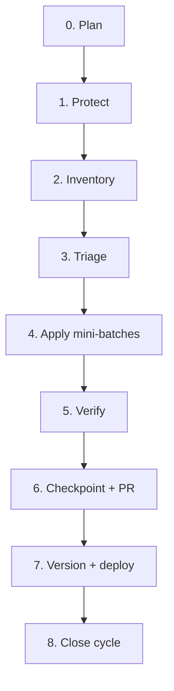

# Manage365 Upstream Sync Process (Monorepo)

This document defines how Manage365 reviews the [CyberDrain CIPP monorepo](https://github.com/CyberDrain/CIPP) on a regular cadence and ports advantageous changes **without** overwriting fork-specific features.

Manage365 previously tracked the split `KelvinTegelaar/CIPP` and `KelvinTegelaar/CIPP-API` repos. Those cycles (through v10.8.5 / Manage365 v5.33.0, August 2026) are archived under [history-cipp/](./history-cipp/) and [history-cipp-api/](./history-cipp-api/). The principles are unchanged; only the mechanics moved to a single repo and a container deployment.

**Related artifacts**

| Document | Purpose |
|----------|---------|
| [history-cipp/CUSTOM_FEATURE_MAP_20260617.md](./history-cipp/CUSTOM_FEATURE_MAP_20260617.md) | Protected fork areas — refresh each cycle |
| [history-cipp/PROCESS.md](./history-cipp/PROCESS.md) | Pre-monorepo (two-repo) edition of this process |
| [README.md](./README.md) | Index of cycle-specific tracking docs |

---

## Principles

1. **Selective intake, not wholesale merge** — cherry-pick or surgical port; never blind `Sync fork → Discard commits`.
2. **Fork features are protected by default** — see `CUSTOM_FEATURE_MAP`. When in doubt, adapt upstream logic into fork files instead of replacing them.
3. **Frontend + backend move together** — the monorepo makes this natural: a feature's `frontend/` and `backend/` changes ship in the same branch, or the whole feature is deferred.
4. **Explicit approval gates** — no production merge without review checklist and version bump.
5. **GitHub "Sync fork" badge is cosmetic** — a large behind-count is expected with selective intake.

---

## Cadence

| Cycle type | When | Duration | Goal |
|------------|------|----------|------|
| **Light delta** | Monthly (or when upstream patch releases) | 2–4 hours | Low-risk bugfixes, data JSON, tests, isolated endpoints |
| **Major cycle** | Quarterly (or after upstream minor) | 1–3 days | Full delta inventory, feature intake decisions, dependency review |
| **Feature intake** | As needed (backlog) | 1–5 days each | New upstream capabilities — design first, then port |
| **Hotfix** | Within 48h of critical upstream security fix | Hours | Cherry-pick specific SHA(s), fast deploy |

---

## Cycle workflow



### Phase 0 — Plan

- [ ] Decide cycle type (light / major / feature intake / hotfix)
- [ ] Record last sync base SHA (from previous checkpoint or tag)
- [ ] For **feature intake**: complete design Q&A before coding

### Phase 1 — Protect

```powershell
# From the repo root
./Tools/Start-UpstreamSyncCycle.ps1
```

- [ ] Backup tag on `main` tip (`backup/pre-upstream-sync-manage365-YYYYMMDD`)
- [ ] Sync branch created (`manage365/upstream-sync-YYYYMMDD`); never commit directly to `main` during review
- [ ] Working tree clean

### Phase 2 — Inventory

```bash
git log --oneline BASE..upstream/main
git rev-list --left-right --count main...upstream/main
```

Generate (or update agent-assisted):

- `UPSTREAM_DELTA_YYYYMMDD.md` — commits since last base
- Refresh `CUSTOM_FEATURE_MAP_YYYYMMDD.md` if protected areas changed

### Phase 3 — Triage

Classify **every candidate** into one outcome:

| Outcome | Meaning |
|---------|---------|
| **Apply** | Clean cherry-pick or copy; no protected-path conflict |
| **Adapt** | Port logic surgically; do not replace whole fork files |
| **Already implemented** | Fork already has equivalent behavior — document evidence |
| **Defer** | Worth doing later; needs design or conflict resolution |
| **Skip** | Wrong for fork (hosted-only, removes customization, low value) |

**Protected-path rule:** If any file in `CUSTOM_FEATURE_MAP` is touched, outcome must be **Adapt** or **Defer** — never blind **Apply**.

### Phase 4 — Apply mini-batches

- Work in batches of **3–5 commits**, low-risk first
- Order: tests → data JSON → isolated bugfixes → shared components → protected areas last
- After each batch: build/test (see Phase 5)
- Record in `APPLIED_COMMITS_YYYYMMDD.md` (upstream SHA | fork SHA | outcome | notes)
- If cherry-pick conflicts: abort, switch to **Adapt** manual port

### Phase 5 — Verify

**Frontend**

```bash
cd frontend && yarn build
```

**Backend** — as applicable:

- Pester tests for touched modules (`backend/Tests`, `backend/Modules/*/Tests`)
- Local container smoke via `build/docker-compose-all.yml` (`docker compose -p cipp -f build/docker-compose-all.yml up --pull always --watch`) for changed endpoints

**Manual smoke** (adjust per cycle):

- Applied standards / drift
- Quarantine + email troubleshooter (protected)
- Top-nav search + dashboard v2
- Any feature touched in this cycle

### Phase 6 — Checkpoint + PR

Write `SYNC_CHECKPOINT_YYYYMMDD.md` with:

- Branch name, base SHA, tip SHA, backup tag
- Mini-batches table (upstream → outcome)
- Applied / adapted / deferred / skipped lists
- Known concerns and follow-ups
- **Recommendation:** ready for PR / needs more work / stop

### Phase 7 — Version + deploy

After merge to `main`:

```powershell
./Tools/Update-Version.ps1 -UpstreamVersion 10.8.5 -Manage365Version 5.33.0
```

- [ ] Bump `frontend/public/version.json` + `frontend/public/manage365-version.json` + `frontend/package.json` + `backend/version_latest.txt` (via script)
- [ ] Update README **Upstream Integration** section
- [ ] Build and push the container image, passing the upstream baseline as `APP_VERSION` (`build/Dockerfile` injects it into `out/version.json`)
- [ ] Deploy the image to the App Service container (staging slot first if configured)
- [ ] Confirm Application Settings → version page shows green / no false out-of-date toasts

### Phase 8 — Close cycle

- [ ] Tag sync completion: `sync/manage365-YYYYMMDD` on merged tip
- [ ] Record new **sync base SHA** in checkpoint (becomes next cycle's `BASE`)
- [ ] Archive deferred items into next cycle's triage queue

---

## Decision guide: merge vs cherry-pick vs adapt

| Situation | Action |
|-----------|--------|
| Upstream fix in a file we never customized | Cherry-pick **Apply** |
| Upstream changed same file as fork (CippDataTable, applied-standards, quarantine) | **Adapt** surgical diff |
| Upstream new feature, no fork overlap | Port files + wire nav/API |
| Upstream dependency major bump | **Major cycle** only; full build/test |
| Full upstream merge | Separate project; conflict marathon; not default |

---

## Revision history

| Date | Change |
|------|--------|
| 2026-06-09 | Initial formal process (two-repo era; see history-cipp/PROCESS.md) |
| 2026-08-15 | Monorepo edition — single repo, container deploy, Craft runtime |
